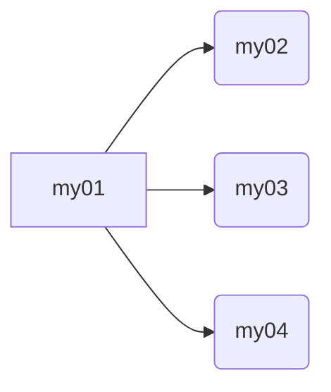
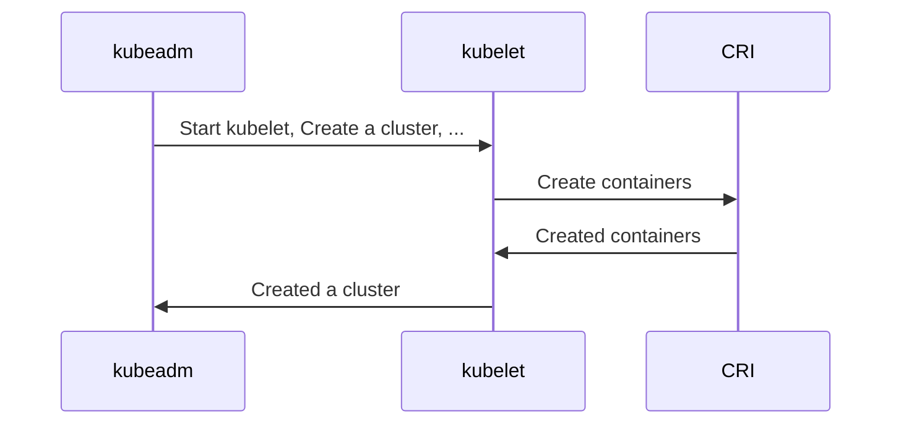
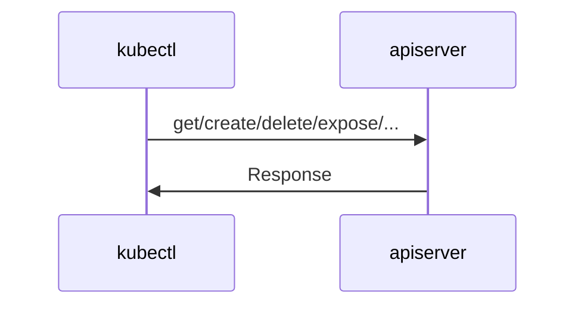

# Building & installing Kubernetes from GitHub source codes

## References
* [Gleaming the Kube - Building Kubernetes from source](http://dougbtv.com/nfvpe/2017/05/12/kubernetes-from-source/) (12 May 2017)
* [Centos 7에 kubeadm을 이용해서 쿠버네티스 (1.13 기준) 설치하기](https://javacan.tistory.com/511) (18 Jan 2019)

## Timestamp of this document
* Created: 190225 (yymmdd)
* Last update: 190225 (yymmdd)

## Environment
* Ubuntu 18.04.2 desktop amd64
* CentOS Linux release 7.5.1804

## Notation
* `#` means that you should run the command with root privilege.
* `$` means that it is recommended to run the command without root privilege.
* `~` is equivalent to your home directory. (e.g. `/home/jhseo`)

# Part 1. Prerequisites

* Run through this part for each server (or machine, VM, ...).
* In each server, configure `[IP address - hostname]` pair.

```# vim /etc/hosts```

```
192.168.254.101 my01
192.168.254.102 my02
192.168.254.103 my03
192.168.254.104 my04
```



* Install some packages
  - Ubuntu:
```# apt-get install ebtables ethtool socat```
  - CentOS:
```# yum install socat```

* Install Docker
  - Ubuntu: 
```# apt-get install docker.io -y```
```# systemctl start docker && systemctl enable docker```
```# docker version```
  - CentOS:
```# yum install docker -y```
```# systemctl start docker && systemctl enable docker```
```# docker version```

* (Optional) Install some packages
  - Ubuntu: 
```# apt-get install vim build-essential htop aptitude -y```
  - CentOS: 
```# yum install vim htop -y```

* (Optional but recommended) Install and use `byobu`
  - Ubuntu:
```# apt-get install byobu -y```
```# byobu```
  - CentOS:
```# yum -y install epel-release```
```# yum -y install byobu```
```# byobu```

* (CentOS) Change SELinux mode: enforcing -> permissive
```# setenforce 0```
```# sed -i 's/^SELINUX=enforcing$/SELINUX=permissive/' /etc/selinux/config```

* (CentOS) K8s iptables config
```
# cat <<EOF >  /etc/sysctl.d/k8s.conf
net.bridge.bridge-nf-call-ip6tables = 1
net.bridge.bridge-nf-call-iptables = 1
EOF
# sysctl --system
```

* (CentOS) Disable `firewalld` (System might be vulnerable)
```# systemctl stop firewalld```
```# systemctl disable firewalld```

* Turn off and disable swap (for `kubelet`)
```# free -h```
```# swapoff -a```
```# vim /etc/fstab```
```Comment out swap line in /etc/fstab```

# Part 2. Build from source

* It is possible to build once and make many master & worker nodes using built files.
* Install Golang
  - Ubuntu:
```# apt-get install golang -y```
```# go version```
```go version go1.10.4 linux/amd64```
  - CentOS:
```# yum install golang```
```# go version```
```go version go1.11.4 linux/amd64```

* Clone source codes from Kubernetes GitHub repository and build
```# cd ~```
```# git clone -b v1.13.3 --depth 1 https://github.com/kubernetes/kubernetes.git```
```# cd kubernetes/```
```# make kubeadm kubectl kubelet```

# Part 3. Place binaries and config files
* Run through this part for each server (or machine, VM, ...).
* Check binaries
```# cd ~/kubernetes/_output/bin/```
```# ls -alh kubeadm kubectl kubelet```
* Copy binaries
```# cp -i kubeadm kubectl kubelet /usr/bin/```
* Check config files
```# cd ~/kubernetes/build/debs/```
```# ls -alh kubelet.service 10-kubeadm.conf```
* Copy config files
```# cp -i kubelet.service /etc/systemd/system/kubelet.service```
```# mkdir -p /etc/kubernetes/manifests```
```# mkdir -p /etc/systemd/system/kubelet.service.d/```
```# cp -i 10-kubeadm.conf /etc/systemd/system/kubelet.service.d/10-kubeadm.conf```
* Add these two lines above the ExecStart= line in `/etc/systemd/system/kubelet.service.d/10-kubeadm.conf`
```
Environment="KUBELET_AUTHZ_ARGS=--authorization-mode=Webhook --client-ca-file=/etc/kubernetes/pki/ca.crt"
Environment="KUBELET_CGROUP_ARGS=--cgroup-driver=cgroupfs"
```

* Wget & place CNI binaries
```
# cd ~
# mkdir cni-binaries
# wget https://github.com/containernetworking/cni/releases/download/v0.6.0/cni-amd64-v0.6.0.tgz
# wget https://github.com/containernetworking/plugins/releases/download/v0.7.4/cni-plugins-amd64-v0.7.4.tgz
# tar xvf cni-amd64-v0.6.0.tgz --directory ./cni-binaries/
# tar xvf cni-plugins-amd64-v0.7.4.tgz --directory ./cni-binaries/
# mkdir -p /opt/cni/bin
# cp -v cni-binaries/* /opt/cni/bin/
```

* (Maybe optional) Configure Docker to use `cgroupfs` for the cgroup driver
```
# cat << EOF > /etc/docker/daemon.json
{
  "exec-opts": ["native.cgroupdriver=cgroupfs"]
}
EOF
# systemctl daemon-reload && systemctl restart kubelet docker
```

* Enable kubelet.service
```
# systemctl enable kubelet.service
Created symlink /etc/systemd/system/multi-user.target.wants/kubelet.service → /etc/systemd/system/kubelet.service.
```

# Part 4. Create new cluster on k8s master node (candidate)



* If you want to use `Flannel` for CNI:
```# kubeadm init --pod-network-cidr=10.244.0.0/16```
* If you want to use `Calico` for CNI:  
```# kubeadm init --pod-network-cidr=192.168.0.0/16```
```
...
Your Kubernetes master has initialized successfully!

To start using your cluster, you need to run the following as a regular user:

  mkdir -p $HOME/.kube
  sudo cp -i /etc/kubernetes/admin.conf $HOME/.kube/config
  sudo chown $(id -u):$(id -g) $HOME/.kube/config

You should now deploy a pod network to the cluster.
Run "kubectl apply -f [podnetwork].yaml" with one of the options listed at:
  https://kubernetes.io/docs/concepts/cluster-administration/addons/

You can now join any number of machines by running the following on each node
as root:

  kubeadm join [IP Address]:6443 --token e686n4.iaal2o7v1z2fu921 --discovery-token-ca-cert-hash sha256:cd3e798e567d08d93edc0d728bd3765c7b6a2296352798c99f66292a070eb4db
```

* The token in `kubeadm join ...` command expires after 24 hours. To re-generate `kubeadm join ...` command, execute:
```
# kubeadm token create --print-join-command
```




* To make `kubectl` command work, execute one of these:
```
export KUBECONFIG=/etc/kubernetes/admin.conf
```
(Set environment variable `KUBECONFIG`. Effective for current shell.)


```
# mkdir -p ~/.kube
# ln -s /etc/kubernetes/admin.conf ~/.kube/config
```
(Create a symbolic link. Effective as long as the symlink exists.)

* Check the nodes in the cluster: `# kubectl get nodes`
```
NAME   STATUS     ROLES    AGE    VERSION
my01   NotReady   master   179m   v1.13.3
```

* Enable CNI
  - If you want to use `Flannel` for CNI:
```# kubectl apply -f https://raw.githubusercontent.com/coreos/flannel/a70459be0084506e4ec919aa1c114638878db11b/Documentation/kube-flannel.yml```
  - If you want to use `Calico` for CNI:  
```
# kubectl apply -f https://docs.projectcalico.org/v3.3/getting-started/kubernetes/installation/hosted/rbac-kdd.yaml
# kubectl apply -f https://docs.projectcalico.org/v3.3/getting-started/kubernetes/installation/hosted/kubernetes-datastore/calico-networking/1.7/calico.yaml
```

# Part 5. Join k8s worker node (candidate) to the cluster

* Execute `kubeadm join ...` command, which is an output of either `kubeadm init ...` or `# kubeadm token create --print-join-command`.

# Part 6. Tear down the cluster
```
# kubectl drain <node name> --delete-local-data --force --ignore-daemonsets
# kubectl delete node <node name>
# kubeadm reset
# iptables -F && iptables -t nat -F && iptables -t mangle -F && iptables -X
# ipvsadm -C
```
